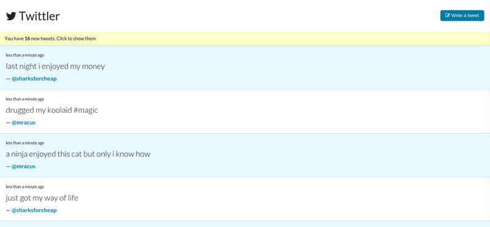

#twittler

This is a project I completed as part of my precourse work at [Hack Reactor](http://hackreactor.com). We were given a tweet generator file, `data_generator.js`, and were asked to build a front-end with the following requirements:

* Show the user new tweets somehow. You can show them automatically as they're created, or create a button that displays new tweets.
* Display the timestamps of when the tweets were created.
* Design your interface so that you want to look at and use the product you're making.
* Allow the user to click on a username to see that user's timeline.
* Show when the tweets were created in a human-friendly way (eg "10 minutes ago"). You'll want to find and use a library for this.
* Allow the user to tweet.